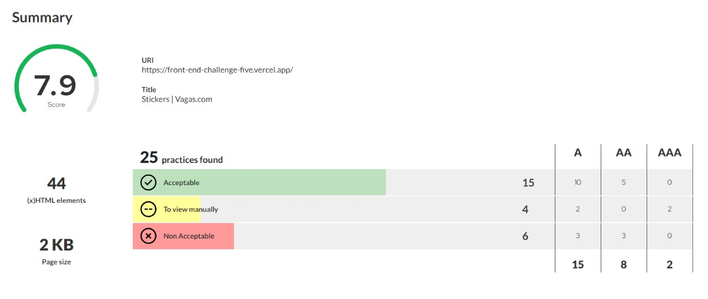
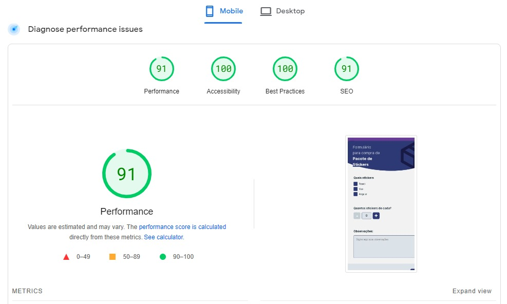
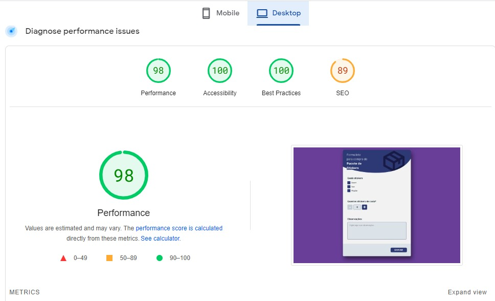
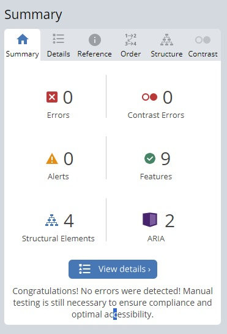

# Desafio Front-End | Vagas.com

> O presente projeto trata-se de um desafio onde é proposto a finalização de um formulário utilizando boas práticas de acessiblidade

## Índice

- [Desafio](#desafio)
- [Soluções](#soluções)
- [Tecnologias](#tecnologias)
- [Startando](#startando)
- [Métricas](#métricas)
- [Contato](#contato)

## Desafio
>
> A Vagas vai patrocinar um evento e fornecer alguns adesivos (stickers) para as pessoas que irão participar. Criamos um aplicativo web para fazer o controle de quantos adesivos serão entregues. Porém, o app ainda não está pronto e precisamos da sua ajuda para finalizá-lo. Esperamos que você faça propostas a respeito da aplicação, incluindo validações e outras decisões como UX e usabilidade.

## Soluções

A ideia para solucionar o problema era criar uma aplicação simples que garantisse escalabilidade, acessibilidade e performace. Para isso construí a página utilizando HTML e CSS puros, e Typescript.

## Tecnologias

Prevendo uma possível escalabilidade, desenvolvi a página com as seguintes melhorias:

- Verificação do código com Eslint e Prettier;
- Validação dos commits com Husky;
- Deploy na Vercel e validação dos merges na branch main (CI)

## Startando

Para rodar o projeto basta rodar instalar as dependências:

```npm install```

E depois startar:

```npm start```

O projeto rodará por default na porta 1234 com o auxílio da biblioteca "parcel-bundler"

## Métricas

- [AccessMonitor](https://accessmonitor.acessibilidade.gov.pt/)



- [PageSpeed - Mobile](https://pagespeed.web.dev/)



- [PageSpeed - Desktop](https://pagespeed.web.dev/)



- [WAVE](https://wave.webaim.org/report#/https://front-end-challenge-five.vercel.app/)



## Contato

[](https://www.linkedin.com/in/lucastamirfaria/) [](mailto:lucastamir@gmail.com) [](https://tamirfaria.vercel.app/)
